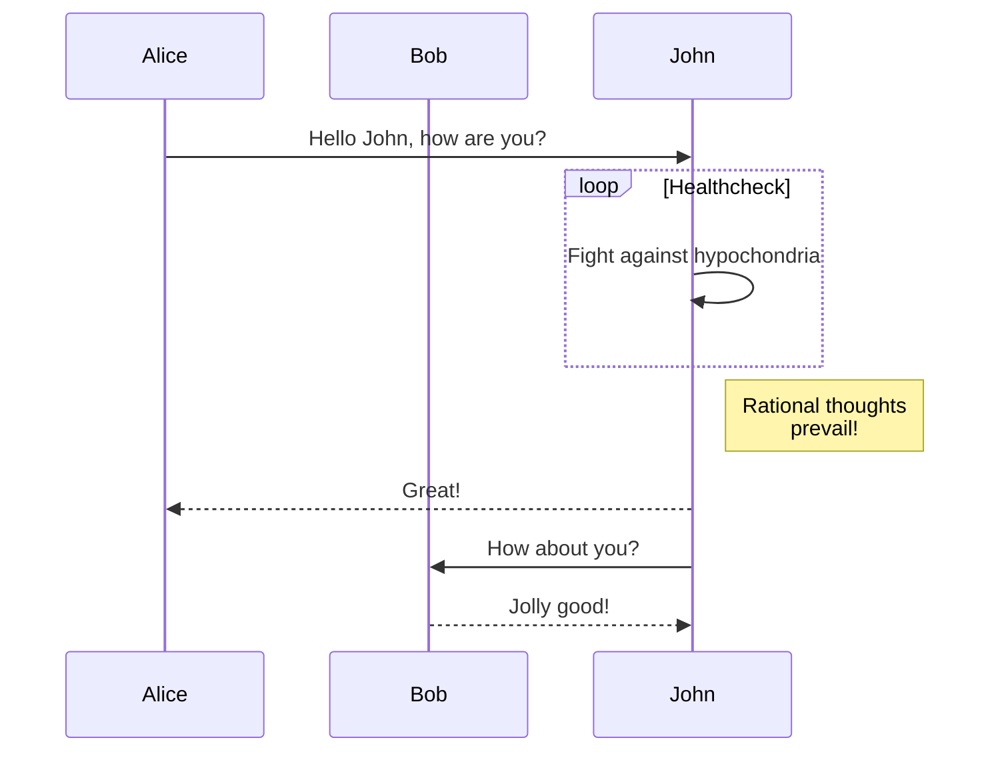

This theme now supports the use of `Mermaid` to draw flowcharts, sequence diagrams, Gantt charts, state diagrams, relationship diagrams, and more in plain text format. With the gradual development of `Mermaid`, various types of diagrams will be introduced in the future. For more types and usage methods, please follow its official website:[https://mermaid-js.github.io/](https://mermaid-js.github.io/).

<!--more-->

## Instructions for use



- Create a new article using the `hugo new` command
- Add `mermaid` short code to the article, and support Markdown code syntax to write the language as `mermaid`
- Write various types of diagrams using short code, with 2 built-in parameters: Align and bc (background color) can refer to the following usage examples



> [!WARNING]
> It is recommended to add textual descriptions in the two `Mermaid` codes to avoid initialization recognition errors and incomplete display of legend content.

## Process diagram

```shell

graph TD;
A-->B;
A-->C;
B-->D;
C-->D;

```


graph TD;
A-->B;
A-->C;
B-->D;
C-->D;


## Timing diagram


```markdown
<!-- 注意把//去掉 -->
// ```mermaid { bc="#eee" }
sequenceDiagram
    participant Alice
    participant Bob
    Alice->>John: Hello John, how are you?
    loop Healthcheck
        John->>John: Fight against hypochondria
    end
    Note right of John: Rational thoughts <br/>prevail!
    John-->>Alice: Great!
    John->>Bob: How about you?
    Bob-->>John: Jolly good!

// ```

```



## Class diagram

```shell

classDiagram
Class01 <|-- AveryLongClass : Cool
Class03 *-- Class04
Class05 o-- Class06
Class07 .. Class08
Class09 --> C2 : Where am i?
Class09 --* C3
Class09 --|> Class07
Class07 : equals()
Class07 : Object[] elementData
Class01 : size()
Class01 : int chimp
Class01 : int gorilla
Class08 <--> C2: Cool label

```

classDiagram
Class01 <|-- AveryLongClass : Cool
Class03 *-- Class04
Class05 o-- Class06
Class07 .. Class08
Class09 --> C2 : Where am i?
Class09 --* C3
Class09 --|> Class07
Class07 : equals()
Class07 : Object[] elementData
Class01 : size()
Class01 : int chimp
Class01 : int gorilla
Class08 <--> C2: Cool label


## Gantt Chart

```shell

gantt
dateFormat  YYYY-MM-DD
title Adding GANTT diagram to mermaid
excludes weekdays 2014-01-10

section A section
Completed task            :done,    des1, 2014-01-06,2014-01-08
Active task               :active,  des2, 2014-01-09, 3d
Future task               :         des3, after des2, 5d
Future task2               :         des4, after des3, 5d

```

gantt
dateFormat  YYYY-MM-DD
title Adding GANTT diagram to mermaid
excludes weekdays 2014-01-10

section A section
Completed task            :done,    des1, 2014-01-06,2014-01-08
Active task               :active,  des2, 2014-01-09, 3d
Future task               :         des3, after des2, 5d
Future task2               :         des4, after des3, 5d


## Entity Relationship Diagram

```shell

erDiagram
CUSTOMER ||--o{ ORDER : places
ORDER ||--|{ LINE-ITEM : contains
CUSTOMER }|..|{ DELIVERY-ADDRESS : uses

```

erDiagram
CUSTOMER ||--o{ ORDER : places
ORDER ||--|{ LINE-ITEM : contains
CUSTOMER }|..|{ DELIVERY-ADDRESS : uses


## User Journey

```shell

journey
title My working day
section Go to work
Make tea: 5: Me
Go upstairs: 3: Me
Do work: 1: Me, Cat
section Go home
Go downstairs: 5: Me
Sit down: 5: Me

```

journey
title My working day
section Go to work
Make tea: 5: Me
Go upstairs: 3: Me
Do work: 1: Me, Cat
section Go home
Go downstairs: 5: Me
Sit down: 5: Me
